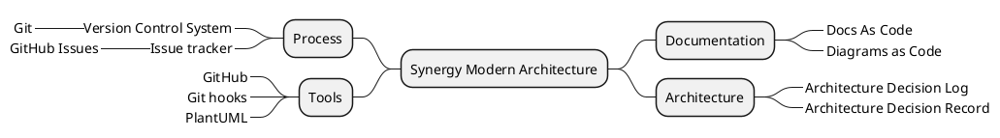

# Synergy Modern Software Architecture Sample

Sample project to demonstrate modern architecture approach

## Architecture

To familiarize yourself with the architectural concepts of this sample project, 
check out the [Architecture Decision Log](docs/architecture/Architecture%20Decision%20Log.md)

## Keywords

> Modern Architecture |
> Architecture Decision Record | Architecture Decision Log |
> Docs as Code | PlantUML | Diagrams as Code |
> Version Control System | Git | GitHub | Git hooks |
> Issue tracker | GitHub Issue Tracker |

<!--

-->
 <!-- ← Generated image link. Do NOT modify it manually. -->

## Online series

* ▶️ [Synergy Software Architecture YouTube Channel](https://www.youtube.com/channel/UCTildHeLP4HoQVexsdrrHLA)
  * ▶️ [GitHub Repository Setup](https://www.youtube.com/watch?v=1xpCQnlqwFE) (5:20)
  * ▶️ [Architecture Decision Log](https://www.youtube.com/watch?v=td3vERoL_KQ) (9:39)
  * ▶️ [Use GitHub for Version Control](https://youtu.be/YZxJj41nQ7A) (5:46)
  * ▶️ [Use GitHub Issue Tracker](https://youtu.be/7S1QSb9skfw) (8:09)
  * ▶️ [Follow Docs as Code approach](https://youtu.be/pv0rfyymEwY) (7:27)
  * ▶️ [Adopt PlantUML as the Primary Diagramming Engine](https://youtu.be/x99410rf_nE) (7:26)
  * ▶️ [Embed PlantUML diagrams in markdown](https://youtu.be/i2aXJNo7owo) (9:09)