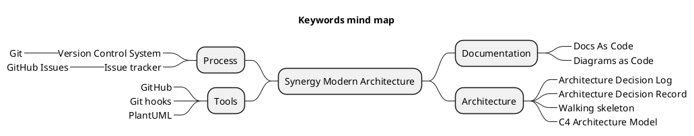

# Synergy Modern Software Architecture Sample

Sample project to demonstrate modern architecture approach

## Architecture

To familiarize yourself with the architectural concepts of this sample project, 
check out the [Architecture Decision Log](docs/architecture/Architecture%20Decision%20Log.md)

## Keywords

This section provides an overview of key terms and keywords commonly used in the project.
Understanding these concepts is crucial for effective communication among team members and stakeholders,
as well as for adhering to best practices in software engineering. 
The chapter outlines essential terminology across various domains, 
including software architecture, coding practices, project management, and development methodologies.

> Modern Architecture |
> Architecture Decision Record | Architecture Decision Log |
> Docs as Code | PlantUML | Diagrams as Code |
> Version Control System | Git | GitHub | Git hooks |
> Issue tracker | GitHub Issue Tracker |
> Walking skeleton | C4 Architecture Model

<!--

-->
 <!-- ← Generated image link. Do NOT modify it manually. -->

## Online video series

* ▶️ [Synergy Software Architecture YouTube Channel](https://www.youtube.com/channel/UCTildHeLP4HoQVexsdrrHLA)
  * ▶️ [GitHub Repository Setup](https://www.youtube.com/watch?v=1xpCQnlqwFE) (5:20)
  * ▶️ [Architecture Decision Log](https://www.youtube.com/watch?v=td3vERoL_KQ) (9:39)
  * ▶️ [Use GitHub for Version Control](https://youtu.be/YZxJj41nQ7A) (5:46)
  * ▶️ [Use GitHub Issue Tracker](https://youtu.be/7S1QSb9skfw) (8:09)
  * ▶️ [Follow Docs as Code approach](https://youtu.be/pv0rfyymEwY) (7:27)
  * ▶️ [Adopt PlantUML as the Primary Diagramming Engine](https://youtu.be/x99410rf_nE) (7:26)
  * ▶️ [Embed PlantUML diagrams in markdown](https://youtu.be/i2aXJNo7owo) (9:09)
  * ▶️ [Bind every commit in the repository to a work item](https://youtu.be/-6X551gnXR0) (10:43)
  * ▶️ [Follow Walking Skeleton Approach](https://youtu.be/xYyhNfAkV-A) (6:44)
  * ▶️ [Adopt C4 Architecture Model](https://youtu.be/3HncZiD_29o) (9:06)