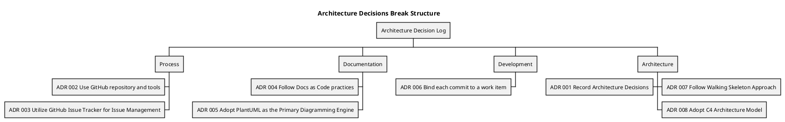

# Decisions log

Below are the decisions made throughout the course of the project, 
along with those that need to be made (or discarded) in the future. 
The decision-making process is not linear, so the list is organized in a way that can be read from top to bottom. 
While not all of these decisions are strictly related to architecture,
they are included here to provide a comprehensive view of the entire production process.

## Contribution

Anyone can create a Pull Request (PR) to propose changes to an existing ADR or introduce a new one. 
The PR will then be discussed and reviewed by the team and, if approved, merged into the `main` branch. 
If you have valuable insights that could be captured as an Architecture Decision Record (ADR),
don't hesitate to share them with us.

### PROCESS

* [002 Use GitHub repository and tools](decisions/002%20Use%20GitHub%20repository%20and%20tools.md)
* [003 Utilize GitHub issue tracker](decisions/003%20Utilize%20GitHub%20issue%20tracker.md)

### ARCHITECTURE

* [001 Record Architecture Decisions](decisions/001%20Record%20Architecture%20Decisions.md)
* [007 Follow Walking Skeleton Approach](decisions/007%20Follow%20Walking%20Skeleton%20approach.md)
* [008 Adopt C4 Architecture Model](decisions/008%20Adopt%20C4%20Model%20for%20Software%20Architecture%20Design.md)

### DOCUMENTATION

* [004 Follow Docs as Code practices](decisions/004%20Follow%20Docs%20as%20Code%20principles.md)
* [005 Adopt PlantUML as the Primary Diagramming Engine](decisions/005%20Adopt%20PlantUML%20as%20the%20Primary%20Diagramming%20Engine.md)

### DEVELOPMENT

* [006 Bind each commit to a work item](decisions/006%20Bind%20each%20commit%20to%20a%20work%20item.md)

## Decisions Break Structure

<!--

-->
 <!-- ↠Generated image link. Do NOT modify it manually. -->