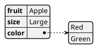

# 005. Adopt PlantUML as the Primary Diagramming Engine


Date: 2023-03-16

## Status

Accepted

## Context

Diagrams play a crucial role in software architecture and documentation, helping to visualize system components, workflows, and relationships.
To ensure diagrams remain version-controlled, maintainable, and easy to modify, we need a standardized diagramming approach that integrates seamlessly with our documentation process.

## Decision

We will use [PlantUML](https://plantuml.com/) as the primary diagramming engine for creating architectural, design, and implementation diagrams within Markdown documents.

Justification:
1. **Automated Rendering** – Diagrams can be generated automatically using plantuml.com, local renderers, or CI/CD pipelines.
2. **Lightweight & Portable** – No dependency on proprietary diagramming tools; diagrams can be edited using any text editor.
3. **Standardization & Consistency** – Ensures a uniform diagramming style across all documentation.

## Consequences

* Positive Outcomes:
  * Diagrams remain up-to-date and versioned alongside documentation.
  * Eliminates dependency on GUI-based diagramming tools.
  * Encourages collaborative editing and reviewing of diagrams.
* Potential Challenges:
  * Team members need familiarity with PlantUML syntax.
  * External rendering tools may be required to visualize diagrams in some environments.

## Implementation Details

* PlantUML diagrams will be embedded in Markdown documents using standard image syntax.
* Rendering Options:
  * Diagrams will be processed and displayed using plantuml.com.
  * Alternative rendering can be done using local PlantUML tools or integrated Markdown processors.
* All documentation containing diagrams will be stored in the project's Git repository to maintain version control.

## Sample

To embed PlantUML diagram into any markdown document in this project,
just insert such comment (sample below) and run [Docs.cs](../../src/Docs.cs) test.

````
<!--

-->
 <!-- ← Generated image link. Do NOT modify it manually. -->
````

## References

* ▶️ [S01E05 Adopt PlantUML as the Primary Diagramming Engine - Modern Software Architecture](https://youtu.be/x99410rf_nE) (7:26)
* ▶️ [S01E06 Embed PlantUML diagrams in markdown - Modern Software Architecture](https://youtu.be/i2aXJNo7owo) (9:09)
* 📚 [PlantUML](https://plantuml.com/)
* 📖 [Include diagrams in your Markdown files with Mermaid](https://github.blog/developer-skills/github/include-diagrams-markdown-files-mermaid/) - alternative diagramming language for Markdown