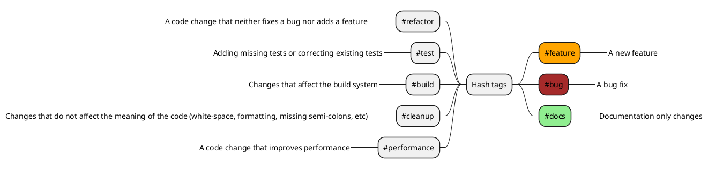

# 006. Bind every commit in the repository to a work item


Date: 2025-03-21 | version: 1.0 | Accepted by Marcin Celej (Software Architect)

## Status

Accepted

## Context

In a collaborative development environment, it is essential to maintain visibility and traceability of changes made to the codebase.
This helps in understanding the rationale behind certain changes, ensuring accountability, and enhancing project management capabilities.

## Decision

We propose to enforce a policy where every commit made to the repository must be associated with a corresponding work item.
This can be achieved through the following mechanisms:

We will add work item number to every commit description. 
The work item number will be added in form  of hashtag - like `#1234`<br/>
It will be automated by using local git hook on each developer machine.

To register the hook (locally) simply run (on Windows) [install.bat](../../../.hooks/install.bat) script.

and follow branch naming conventions:

```
#feature/#1234-some-feature-branch-description
#bug/#1234-some-fix-branch-description
#docs/#1234-some-fix-branch-description
```

The hook automatically gets the work item number from the branch name and silently adds it at the commit description beginning (along with other hashtags found in branch name):

```
#1234 #docs: Commit original description
```

This `#number` (and any other `#hashtag`) can be also added manually to the commit description

### Hashtags

Moreover, the team should use set of well known and common #hashtags in the branch names to automatically (or manually) add them to the commit description. E.g.:

<!--

-->
 <!-- ← Generated image link. Do NOT modify it manually. -->

## Consequences

* Positive Outcomes:
  * Every commit in the repository is bound to a work item
  * Every work item contains set of links to commits connected to it
  * Git blame on every file shows not only commit descriptions but also work items that can be checked for further details
  * Changelog is generated automatically from git changes - combining details from Issue Tracker and git commits kept on release branches
  * Hotspots are automatically tracked in code base just by pointing out files with commits marked with #bug hashtag
* Potential Challenges:
  * Developers are forced to follow branch naming conventions (with hook installed) or to add the work item numbers manually to every commit

## References

* ▶️ [S01E07 Bind every commit in the repository to a work item - Modern Software Architecture](https://youtu.be/-6X551gnXR0) (10:43)
* 📖 Alternatively we could use conventional commits - https://www.conventionalcommits.org