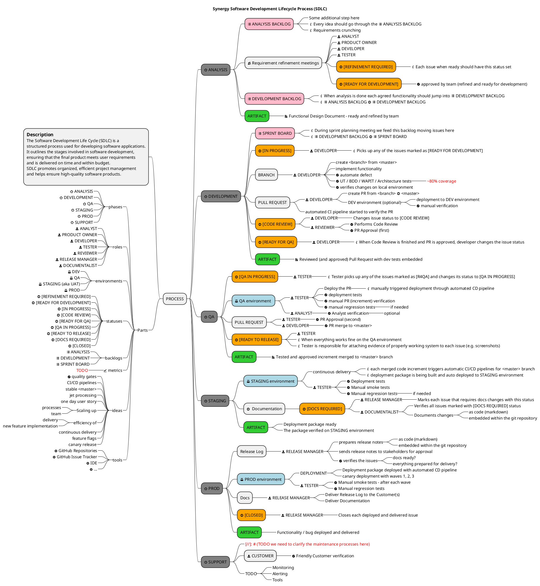

# Software Development Process Lifecycle

## Team

| Role                                     | Team member          |
|------------------------------------------|----------------------|
| Product Owner                            | ??                   |
| Scrum Master                             | Marcin Celej         |
| Development Team (including testers) | Marcin Celej, ??, ?? |
| Release Manager                          | ??                   |
| Documentalist                            | ??                   |

## Product backlog

Current product backlog is materialized as list of issues at [GitHub Issues Tracker](https://github.com/synergy-software/synergy.sample/issues) 
Sprint backlog (board) can be found at [GitHub Modern Software Architecture Sample Project](https://github.com/orgs/synergy-software/projects/1) (access required).

## Ceremonies

Scrum Master plans recurring ceremonies within the team:
* Sprint planning
* Daily scrum meeting
* Sprint review
* Sprint retrospective
* Product backlog refinements

## Process diagram

Each issue tracked on the sprint board should progress through all the phases outlined in the diagram below.

<!--

-->
![diagram](https://www.plantuml.com/plantuml/png/l5dRRjj84dqtu7ye8DY1REIojuT5DkCPHPGzmigM8ia90YCGAB8bTKooETsa3St3_DW-x2VjB-pfRf9gKQ95pSC2GMopYzrLfwjENVZVV__dPvNvCejv4iP-UdwMyInYDDqaJAusD1NBxDcNZ3psn2AHnYp9QCYNBDW441jB4J2bg3FrXhsByxFpiqiQJqQz_dHwVYRvQfsHuY4p2vSFhrQIRRxHXn_ybCaib-oAkdVTuTVf0DANMk3w-kF7Na-BH5nbssNwsEtzQpYwCMANSwWLC_B3a6TS97v4AcCfhPbafS277tYo55VKVs9oGr319xKMUHJIIb2sbY9VhV6J7Jsft6Z2VisvPDf-HO7Cas3DavMHWapAH1gn7IcIRCaJ-slCM0PfjTqK02YHbCVEzXU0edVVcz7eorr_ih_izJ_tXwFneQLPVpehdp-y6aa_MJ43kfJY-Kt09IxkZRcRAtgOzAy7T_tR_jsC9lrFzuD9t_jcNtL1z8CrSQLoHizhbi0oFzoKUAxz9mOakS8b-5cE7onhVNZN-qhNeqbfZjR3FRwG3zOiUBmYFqsbU68XBJQKCJ-cZeKu93y92wMMGbAuTTMB1hzopckwy2_QKX_EjL6m3Vz2aJ1Y6WeVVenJbt02wtyyg-3udiSfyIGJfvpLv8GDm1tR-U7LaCVi1aectwWxcGskkpt7nK8Hv1gSAxgkB41yAxvAo2lMw4q1g8NMmbpWtXpDZa8Dm4_7au7MTjITU7KKl5mYI4Yb-95H6lb9elykWeUU6IqrxCRN5dxm60aiYYUzPfnJ7MI05y0w0k-UhaSTUd2du_Pc0lhxTZHc7Ht7F7XKbAT0UqDYQOYfC2dsvQFsSDKKBaHaMUZZf7lN-wNDiG6kDWFrBM1DiBwYfHGnVOXziAYyggHu34eplh3ZwCtXcMSYrlk63EaXQvIxdz4x-kXv-FzBTppGVtKbs3J3I_0Yk9ZA2gOqhmSY4lAzPE7Lx__uyvye00L8VyKQzySoNt905wprPIaI2KKYW8-pv8bBaMYRB6JZ--7Gy1ueymJWnfC2iXB01Z-g8ueDNHse8r8BgwKf8nEoD18RimmEgRtXe58pElQJ71PQsmDVRriQLDvBIBq1fJnb4O9PaxNKpt28UMbZd6uyQUVelP7N1t2V1_qlhHozLro5JI95ei3HHpQo2pi1islsc4amVgoe9qA6xFl4sNEpy8Iw9eK0gCwIIrMbXzPvwbFtfBWsESHHJQSHK2bNwo9fGIKyAXFRwp9rCLavRqK59MgdCRmz5wTrz77bGHSqpgF8L2i8DdhcsLeVRKEFMBnWOSZ2Pfx_r6q7tASklKo9RgtYu3Q37i0WRKUBVyUj63HBp3YCS7pia1OFhoAjuoBAZVOBvZyYKc7OJe0ULTWpqUg6peuTDYeZ202H5P9Jk1FVHHdg1AXN1MYZ5xiRE4pPI0bmiGvFm5oc7Zh04CslIeQhLmgITLBcIqgGYxMFl5ZH7jYxQqggx90Ya2uPiGq_xpdF2-6kM22IyA9TyExj4wCNGc8IkvJUaZTc8vWmx7Ud_IC1KECDK87SeDZHfO-G20HTXEbafhrjrr7hxnVn0sh1_QKYKNo1PatNndwMeOBLUu8OGfO4s759G0aAmK_rGQO6mmsnM5ji2bvBG1tsTlMM55o99QXsCtLn6XSPhIplLQLyvPaMuz05cMnwRQQXwQnxCxYxUIcW2v53OC4XK5Vc0YmH8kGqsdj4PAmlD0iqZs_rBK9QbU7B0-JNTqu4AmFudZ6r4vnmJb7Jeh3HrxPW-XOMEOyoYnVEA4GjHY_OrJf0lBPCSclfGCNYaRKJRSiS3P5JjI4EEnoDDc_KcnviOhVLX8b2kWL5tLIuGEGMoKIvdfwjVTs_crvUDtx1jfWqkT9fTm-S0qNkTMdU7Gug7eJ0vx8kHKQefJ6pQSs0tVrrhYamgNGfbtIDfwnxTlI6eNXEBfp5Cf-ROxZbZnNN1gP2yKmKVlzY77lxRchwmt9zXZtBXQ803pLN7VJJfdZMCm_h5XCMCLyn6WexOcbnZtEm64ingjAaPzzE19nl2-0-I4M2RmTIAJp7X2C9QwVecCI5FRArY4BD2ePiY_Hpl5NPLZPE9w3Tpe3yawFcDYaKveR5pCCos4_q4XjgW0zHXjSV3qTVgxQzuS8h_Z7kUh1gsM8KO7G2p1nwCsyzOrgaw2-lwQ-lwMydCzO-4M5EuIzrhZFHgtV_GzIaWqkrzpJFekswgNO0VOkzN04N9Zj5TdJ5zrdjUACr74qhDckZMYyI2WWREAeBqocay12TSmt7jMWahdS6NE-GZrODUxwGe-_7uz74RhdJp3-yU_VjFRsYpcpaZVHmHwS5ZM8G-LK_6liO1R44cHFqOcVDnPZ7eki0qhkVpaQtRYsrU_tNaYDiKUEKDxHVWOB6e4kvmQr8TDoNKruywKQmolbx9aG4hpa_YzYo77HVNhx_yKSCqmB9JIbxVgQfiN6CJZqpHxVpSzCBubvK9dCp2mbBeobNLQ2R3KoHLcuAdeaAEzJRyxD1HYBFR0cYGGGlcQueUHAHhRcshpgpqjVdPwZhx0pE943zBcfEn0oq2A6H6SKPNMIP7Kr2EZ_Jpg17f9MFwUY2OnalAHXraOShba4_RQlUCZR4AUJAJ_XlkljbIrm7DvGZnNUCWtGZ0jsBNapljMPH2k_MUZ9Q8qZU_9eNyzVIf49PZSG_zNtCQOnHXurk98ar0jO9zOPF4RMr-c2pjbpqmxMdRdbQMweoNVsLdMYH8cB__sy6pGEOe_ppSXKqTrEFOrUPdQ3V_aCNsdfHt_4VVRhlpfospirqnQ6sZjgvyzE-XCp_oFUBnfSE3qHEcBATCg8wRIfpQXFRkWoVjqblytAexzpKxcUH-lE3KTamkzTBA-cdcDR63BsRa-wtEQcY_xdvPAYQSad9EIlKFvLGhVih7yFzTFEzEmoUqtUMbUJkP1JzYIdqDvPYaQRAbXHVF370rioSfrMghn9YzSH-dR6_bsGQwD5P9R7NwIQOIYunrTPyMatyT-R7ZNtol7fn6VdRMoiglw8yBk3CRAgiu1IhAxhXsI_v0aLKKM6Z43uiCJ05oqp2FPYiYGoyVkt9sxTW_lEpdv7jgu_Q_mC00F__0m00) <!-- ← Generated image link. Do NOT modify it manually. -->